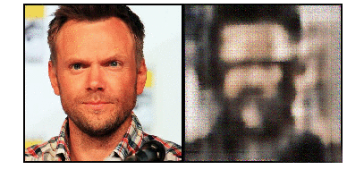

## Extreme image compression using Generative Adversarial Networks

This repository provides a learned compression algorithm for human portraits.

Use the following to clone this repository:
```bash
git clone git@github.com:mlomnitz/CompressionGAN.git
```

## Description 

This package provides an image compression algorithm using an auto-encoder in a Generative Adversarial Network (GAN) setting. First described [in](https://arxiv.org/pdf/1804.02958.pdf), the implementation in this work focuses on human faces, more specifically profile pictures.

The network was trained using a subset of 40K images curated from the [DEX project](https://data.vision.ee.ethz.ch/cvl/rrothe/imdb-wiki/) to produce faithful reconstruction of human faces with a factor of 20-30 in compression.



## Requirements

This package and associated requirements can be installed with pip, using the following:
```bash
pip install -r requirements.txt
python setup.py install 
```
The data set used for training/validation/test can be downloaded with the following [link](https://storage.googleapis.com/comp_gan_public/imdb_quality_faces_v3.zip) 
The following lists the available trained models and associated configuration files:
 - Model trained for 40 epochs, without noise sampling: [Epoch40](https://storage.googleapis.com/comp_gan_public/no_noise_epoc40/gan_epoch40.tar), [configfuration](https://storage.googleapis.com/comp_gan_public/no_noise_epoc40/config)

More trained models will be made available as future experiments are completed.

## Run a test

The scripts folder includes three python files that can be used to train the model, compress an image and expand a compressed image. You can view the arguments for any of the scripts by running with the -h option, for example:
```bash
python scripts/train.py -h

```
We can also run inference on one of the provided images (in the images folder) with the following example:
```bash
python scripts/compress.py -r checkpoints/gan-40 -i images/test3.jpg -o samples/test3
```
At present this will output 3 files to the samples directory, a jpg of the reconstructed image, a pdf comparing the input and reconstructed image and a txt file with the bitstring for the compressed file.
